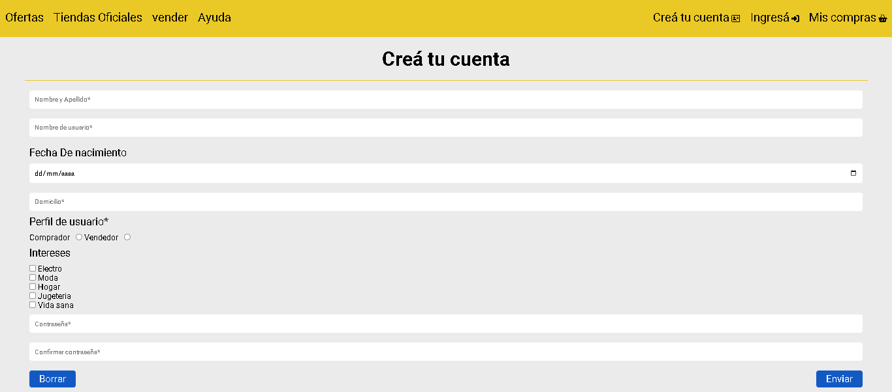
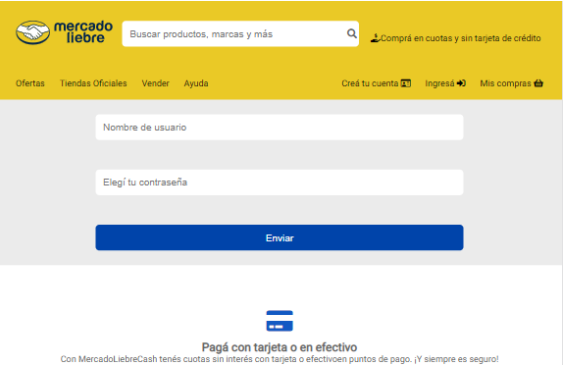

# Trabajo Practico - Mercado Liebre - Formularios

## Desafío 1 - Crear Formulario de registro de usauario

### El formulario para ingresar un nuevo usuario a nuestro sistema se mostrará cuando seleccionemos la opción . Este deberá contar con la siguiente información:

- Registro de Usuario (register.html ):

  - Nombre y apellido
  - Nombre de usuari@
  - Fecha de nacimiento
  - Domicilio
  - Perfil del usuario (consultar a l@s usuari@s si quieren comprar o vender)
  - Contraseña
  - Confirmar contraseña
  - Botón de enviar que nos lleve a la página principal
  - Botón de borrar todos los datos del formulario
- Categorías de interés (puede elegir más de una):
  - Electro
  - Moda
  - Hogar
  - Juguetería
  - Vida sana
----
- mockup del desafio:

---
 
## Desafío 2 - Crear Formulario de Login

### El formulario para ingresar al sitio se mostrará cuando seleccionemos la opción  . Este deberá contar con la siguiente información:

- Login de Usuario (login.html ):
  - Nombre de usuari@
  - Contraseña
  - Botón de enviar que nos lleve a la página principal
---

- mockup del desafio:

