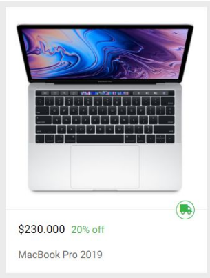
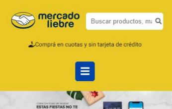
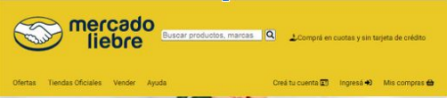
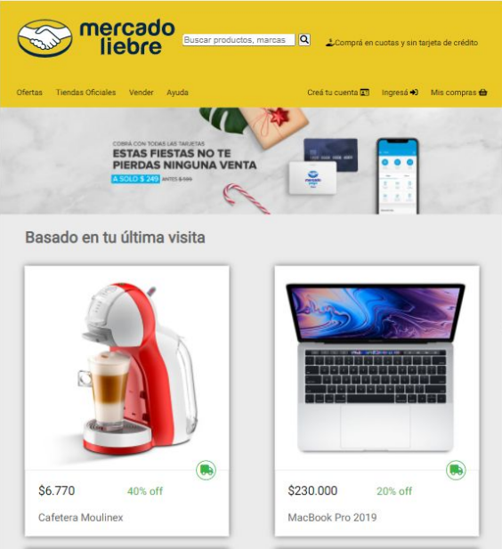
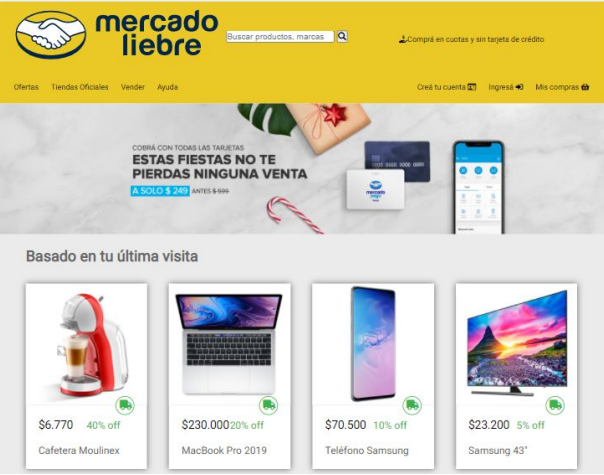

# Trabajo Practico - Mercado Liebre - Posicionamiento avanzado FlexBox

## Desafío 1 - Desarrollar la caja de productos con FlexBox

### Para cada uno de los artículos debemos:

- Lograr que el precio y el descuento de los artículos estén en el mismo
  renglón, donde el precio ocupa el 30% y el descuento el 70% del total del
  renglón.

---

- mockup del desafío

 
 
## Desafío 2 - Desarrollar Home con FlexBox

- Nuestro nuevo desafío es desarrollar la Home utilizando Flexbox, teniendo en cuenta que
  el sitio debe ser 100% responsive. Qué debemos modificar para que, aplicando Flexbox,
  solo se vea un artículo si estamos en mobile, dos artículos para tablet y cuatro artículos
  para la versión desktop

---

## Desafío 3 - Desarrollar Header con FlexBox

- Encabezado: nos piden que la primera parte del encabezado quede de la siguiente
manera:

   - Logo: tiene que medir el 50% de su contenedor.
   - Barra de búsqueda: tiene que medir el 50% de su contenedor.

---

- Mockup del desafío

-------------------
- Para dispositivos con resoluciones igual o superior a una tablet, el header debe visualizarse de
la siguiente manera:

## Resultados en esta etapa del trabajo practico:

