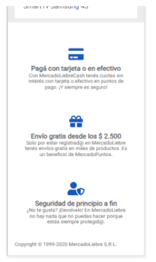

# Trabajo Practico - Mercado Liebre - Agregando Estilos

## Desafío 1 - Darle estilo con CSS al Header

### Esto son los estilos generales:

Paleta de colores:
   - Amarillo: #EAC926;
   - Azul: #03264C;
   - Celeste: #1259c3;
   - Gris oscuro: #666;
   - Gris claro: #ebebeb;
   - Verde: #39b54a;

Tipografía:
   - Familia: 'Roboto'

Tamaño de tipografia:
   - Cuerpos de texto: 12px
   - Titulares (Basado en tu última visita/Ofertas): 24px
   - Precios: 18px
   - Descuentos: 16px
   - Descripciones: 16px

Íconos:

 - Vamos a usar los íconos de esta pagína : https://fontawesome.com/icons?d=gallery&m=free

**************************************************************

- Mockup del primer desafío

## Desafío 2 - Implementar un "Menú de hamburguesa"

### necesitamos agregar estilos para que se vea igual que el mockup de arriba

**************************************************************

## Desafío 3 - Darle estilos con CSS al Footer

- El contenido de todos los artículos está centrado.
- Los íconos tienen un tamaño de 2em y un margen inferior de separación de 10
píxeles.

**************************************************************

- Mockup del desafío

## Resultado en esta etapa del trabajo practico: 

